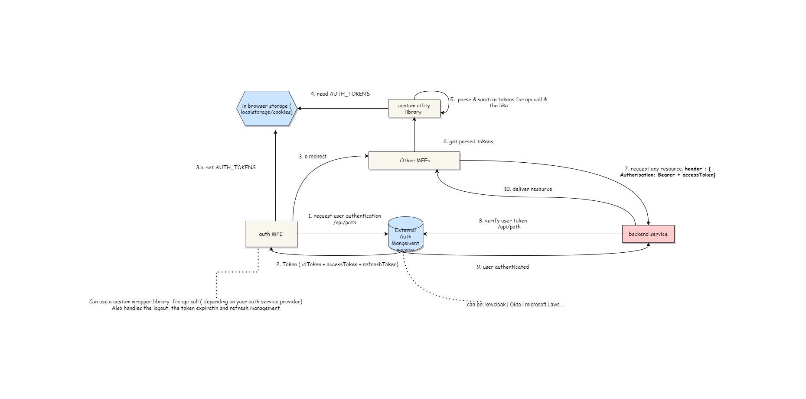

# AUTHENTICATION FLOW

It is recommended to use a dedicated microfrontend to handle authentication flow. We often call it **_Auth MFE_**.

It should be responsible of:

- _getting authentication credentials on login requests_ from an authentication mangement service provider.  It can be Keycloak, Okta, Microsoft or any other that fits your need.

- _setting authentication credentials to othe MFEs_ using shared state or in browser storage

- _handling credentials expiration_ by refreshing them or  login out the user

A generic  flow is depicted by the diagram below.

## Token retrieval

THe retrieval mecanism is internal to the flow defined within your  authentication mangement service provider. You can also use use custom library inside the Auth MFE to query the service provider.

## Credential sharing

TODO

## Handling credentials expiration_

TODO

## Examples

### Keycloak

TODO

### Okta

TODO

## Microsoft

TODO
